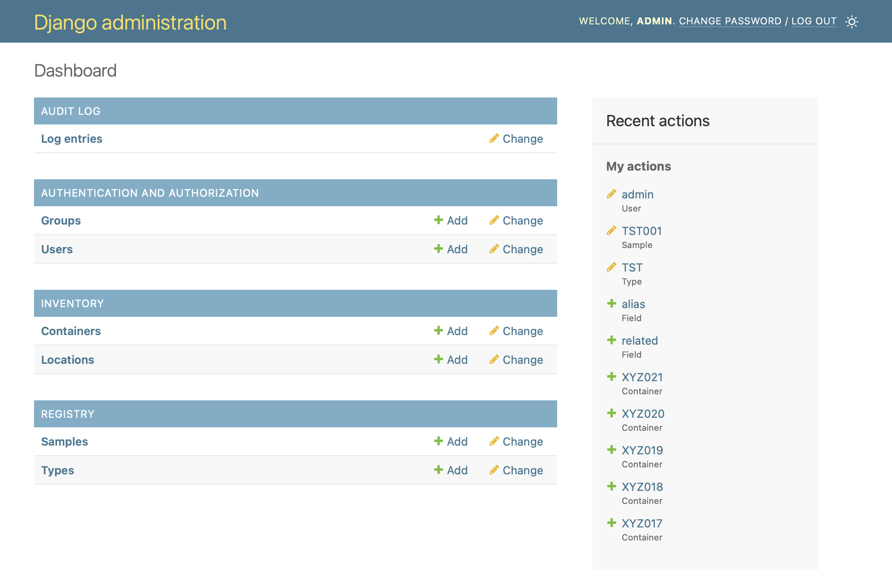

Frontend
=====

Django Admin
------------
Django provides an admin interface out of the box - one of its strengths 
compared to other web frameworks. This admin interface automatically generates 
tables and forms for CRUD operations on the database tables the developer defines. 

The admin site is typically used only by site administrators and staff. A typical
use case might be content management for the site, as well as basic interaction 
with the default User and Group tables defined by Django. 

However, for a straightforward CRUD app like this LIMS, Django Admin provides 
most of the necessary functionality already. Rather than reinventing the wheel, 
this demo starts with Django's admin page as the base, and adds a few extra features 
on top (such as the ability to import and export).

Unfold Admin
----------------
The default styling for Django's admin site is perfectly adequate for back-office 
use, but leaves a lot to be desired when used as the main page of an app. To improve 
the styling, this site uses `Unfold Admin <https://unfoldadmin.com/>`_ a theme designed specifically 
for Django's admin site. This theme is written using Tailwind CSS, and can be easily 
extended and customized. 
