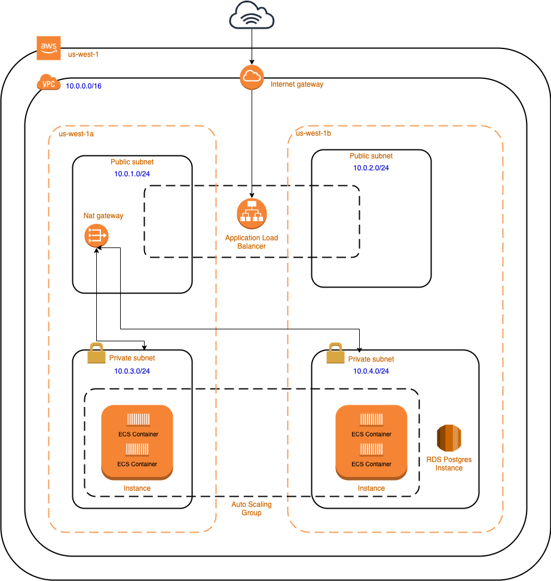

Infrastructure
=====

Docker
------------
Docker is used to package this application into a container, along with all of its 
dependencies, libraries, and configuration. This is helpful for ensuring the environment 
remains consistent between development and production, as well as between developers when 
collaborating on a project.

This project is also hosted on AWS, which automates the deployment of Docker containers via 
Elastic Container Registry (ECR) and Elastic Container Service (ECS). ECR stores container 
images, and ECS deploys and orchestrates these containers, enabling efficient scaling and 
load balancing for minimal downtime. 

Terraform
----------------
Terraform is a tool for defining Infrastructure as Code (IaC), which allows me to commit the 
AWS infrastructure for this project alongside its code. Once defined, this Terraform 
configuration can be used to provision, update, and tear down actual AWS resources with a 
single command. 

Managing my infrastrure definition and deployment through Terraform means that infrastructure 
is implemented exactly as I intend, and allows me to iterate on infrastructure the same way I 
do with other code for this application. 

AWS
----------------
The AWS architecture for this project is based on my 
`fork <https://github.com/williamcpierce/django-ecs-terraform>`_ of a project from 
`testdriven.io <https://testdriven.io/blog/deploying-django-to-ecs-with-terraform/>`_. Their 
diagram of the AWS resources used is shown below: 

Source: `testdriven.io <https://testdriven.io/blog/deploying-django-to-ecs-with-terraform/>`_
